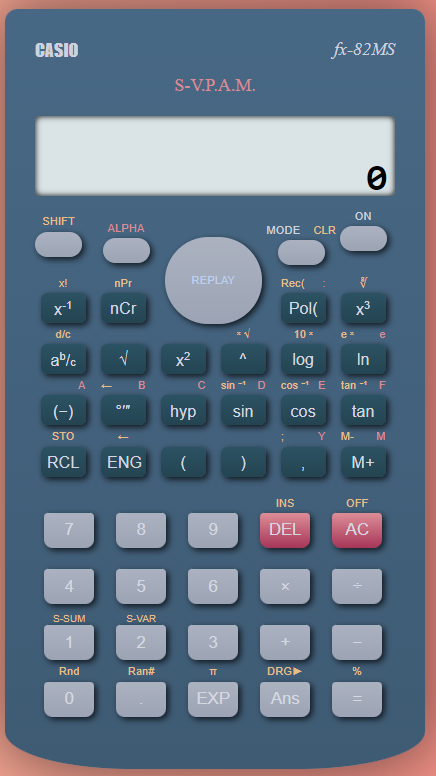
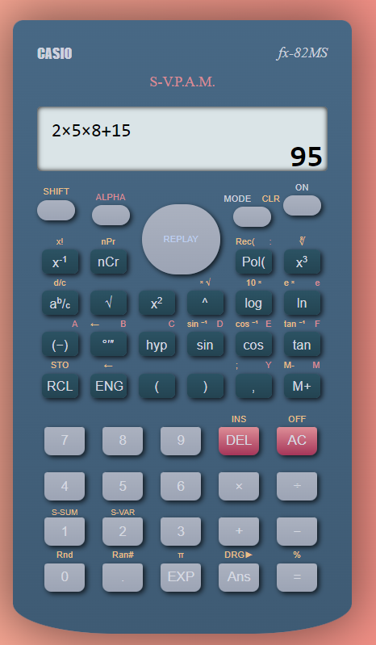

# Casio fx82 ms Calculator Replica

Experience the nostalgia and my CSS prowess with this virtual rendition of the iconic Casio fx82 ms calculator. While the functionality is limited to basic math operations, the calculator's design is an intricate showcase of HTML, CSS, and JavaScript skills. Without using any images, I've meticulously recreated the calculator's authentic appearance. 

## Check It Out
To see the project in action, visit: [Casio fx82 ms Calculator Replica](https://ng-sci-calculator.netlify.app/)

## Features
- Accurate replica of the Casio fx82 ms calculator design using pure CSS.
- Basic arithmetic operations such as addition, subtraction, multiplication, and division.
- A visual treat that demonstrates CSS capabilities without complex math functionality.

## Usage
Simply open the `index.html` file in a web browser to explore the interactive calculator. Click the buttons to input numbers and perform basic calculations.

## Preview

## Contribution
Contributions and feedback are welcome! If you have ideas to enhance the design or add functionalities, please feel free to submit pull requests.

## Credits
Designed and developed by [Your Name]
